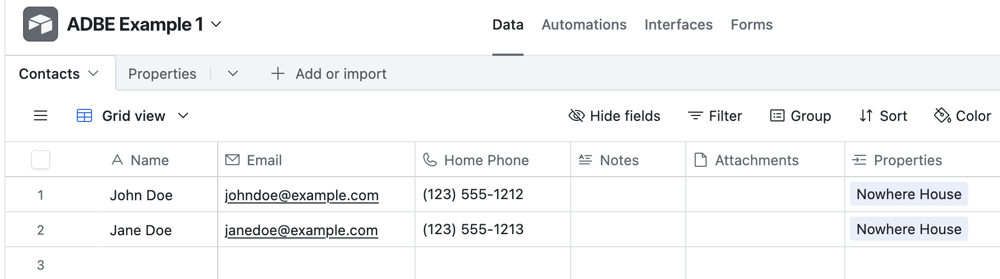
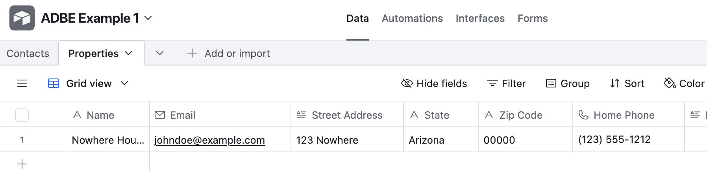

.. _example:

End to End Example
==================

.. _example_sample_app:

Sample App
----------

The best way to show what Airtable DB Export does is to show it. We have an astonishingly simple Airtable app for managing properties and residents:

A Contacts table with some basic fields about people:

A Properties table with an address and a link to Contacts as "Residents"

This will be tour sample app.

.. _example_setup:

Setup
-----

First we going to need an Airtable API token, which you can create at the `Airtable Buider Hub <https://airtable.com/create/tokens>`__. For you app you will need to create a token with ``base.readSchemas`` and ``data.reaedRows``

 The easiest way to use the API token in local development is to create a ``.env`` file in your repo (make sure it's ignored by your source control) and add the token like:

.. code-block:: bash

   AIRTABLE_API_KEY="<api token>"

Since this is a Python library, we're going to assume you have a Python project with an environment already set up. If not, see `Installation <install.html>`__.::

.. code-block:: bash

    $ pip install airtable-db-export
    $ adbe --no-config-file create-config adbe-config.yml

This installs Airtable DB Export and starts a local configuration file for your app. Open up ``abde-config.yml`` (the name is not itself important) in an editor and let's see what the
command created.

.. code-block:: yaml

    # EXAMPLE Airtable DB Export config

    # if set, generate all files relative to this directory (created, if it doesn't exist)
    base_dir: generated

    # name of the intermediate file that maps the actual Airtable schema to your
    # configured SQL schema.
    # Relative to base_dir.
    schemas_file: schemas.json

    # where to create downloaded JSON files
    # Relative to base_dir.
    datadir: data

    # where to create the CREATE statement files for your new tables
    # Relative to base_dir.
    sql_dir: create_sql

    # path to the generated database file.
    # Relative to base_dir.
    db_file: myapp.duckdb

    # completely ignore Airtable fields matching these
    # regular expressions
    column_filters:
      - " copy$"

    tables:
    # NOTE: any tables that need to be related by ID need to come from the
    # same Airtable base

    # bases need to be identified by ID, found in the Airtable URL starting
    # with "app"
    - base: appRandomStringBaseID
      # tables can be identified by name
      airtable: My Table
      # name of the SQL table to create
      table: my_table
      # if true: only export and create the specified columns
      all_columns: false
      # mapping of Airtable fields to SQL column names
      # used to specify field names, otherwise column names will be
      # "cleaned", removing non-alphanumeric characters and replacing
      # spaces with underscores (_)
      columns:
        "Name": name

.. _example_update_config:

Update Config
-------------

We're going to leave most of the simple options as they are in the generated
config, and start updating the tables for our sample app.

.. code-block:: yaml

    - base: <app id>
      # add our first table
      airtable: Properties
      # name of sql table
      table: properties
      # mapping of Airtable fields to SQL column names
      # used to specify field names, otherwise column names will be
      # "cleaned", removing non-alphanumeric characters and replacing
      # spaces with underscores (_)
      columns:
        "Name": name
        "Street Address": street_address
        "State": state

    - base: <app id>
        # tables can be identified by name
        airtable: Contacts
        # name of the SQL table to create
        table: contacts

.. _example_generate_schema:

Generate Schema Mapping
-----------------------

Now that we have our config, we'll generate the schema mapping file. The file is
intermediary and is used by the ``create-sql`` and ``create-db`` commands.::

    $ abde -c abde-config.yml generate-schema-map
    Generating schema mappings to file: generated/schemas.json

Then take a look at the file:

.. code-block:: JSON

   [
     {
         "base": "app65Q3AdZDRc3C71",
         "airtable": "Properties",
         "sqltable": "properties",
         "columns": [
           {
               "field": null,
               "type": null,
               "sqlcolumn": "id",
               "sqltype": "varchar",
               "extra": "primary key"
           },
           {
               "field": "Name",
               "type": "singleLineText",
               "sqlcolumn": "name",
               "sqltype": "VARCHAR"
           },
           {
               "field": "Street Address",
               "type": "multilineText",
               "sqlcolumn": "street_address",
               "sqltype": "VARCHAR"
           },
           {
               "field": "State",
               "type": "singleLineText",
               "sqlcolumn": "state",
               "sqltype": "VARCHAR"
           },
           {
               "field": "Zip Code",
               "type": "singleLineText",
               "sqlcolumn": "zip_code",
               "sqltype": "VARCHAR"
           },
           {
               "field": "Home Phone",
               "type": "phoneNumber",
               "sqlcolumn": "home_phone",
               "sqltype": "VARCHAR"
           },
           {
               "field": "Notes",
               "type": "multilineText",
               "sqlcolumn": "notes_md",
               "sqltype": "VARCHAR"
           },
           {
               "field": "Residents",
               "type": "multipleRecordLinks",
               "sqlcolumn": "residents_ids",
               "sqltype": "TEXT[]"
           }
         ]
       }
     ]

Some notes on the file ABDW produced:

- The first column defined has a null ``field`` and ``type``; it's an auto-generated ID field in which ADBE will store the Airtable recordId for each row.
- The "Notes" field ("notes" column) is a "multilineText" field, with the "Enable rich text formatting" option set. Airtable uses Markdown for rich text, so ADBE automatically appends "_md" to the SQL column.

.. _example_create_sql:

Create SQL Files
----------------

To create the database ABDE can generate the SQL CREATE DDL for each new table.::

    $ adbe -c abde-config.yml create-sql
    Generate CREATE DDL
    CREATE DDL complete

Now inspect the created files:

.. code-block:: bash

    $ tree generated
    generated
    ├── create_sql
    │   └── create_properties.sql
    └── schemas.json

    1 directory, 2 files

Then ``create_properties.sql``:

.. code-block:: SQL

    CREATE TABLE IF NOT EXISTS properties
    (id varchar primary key,
    name VARCHAR ,
    street_address VARCHAR ,
    state VARCHAR ,
    zip_code VARCHAR ,
    home_phone VARCHAR ,
    notes VARCHAR ,
    attachments VARCHAR ,
    residents_ids TEXT[] );

...and ``create_contacts.sql``:

.. code-block:: SQL

    CREATE TABLE IF NOT EXISTS contacts
    (id varchar primary key,
    name VARCHAR ,
    email VARCHAR ,
    home_phone VARCHAR ,
    notes VARCHAR ,
    attachments VARCHAR ,
    properties_ids TEXT[] );

.. _example_create_db:

Create the Database
-------------------

Run the command to create the DB:

.. code-block:: bash

    $ adbe -c abde-config.yml create-db
    db_file: /Users/sivy/projects/abde-test/generated/myapp.duckdb
    Create database in generated/myapp.duckdb
    generated/myapp.duckdb: creating properties
    generated/myapp.duckdb: creating contacts

Then let's look at the created database:

.. code-block:: bash

    $ duckdb generated/myapp.duckdb
    v1.0.0 1f98600c2c
    Enter ".help" for usage hints.
    D describe properties;
    ┌────────────────┬─────────────┬─────────┬─────────┬─────────┬─────────┐
    │  column_name   │ column_type │  null   │   key   │ default │  extra  │
    │    varchar     │   varchar   │ varchar │ varchar │ varchar │ varchar │
    ├────────────────┼─────────────┼─────────┼─────────┼─────────┼─────────┤
    │ id             │ VARCHAR     │ NO      │ PRI     │         │         │
    │ name           │ VARCHAR     │ YES     │         │         │         │
    │ street_address │ VARCHAR     │ YES     │         │         │         │
    │ state          │ VARCHAR     │ YES     │         │         │         │
    │ zip_code       │ VARCHAR     │ YES     │         │         │         │
    │ home_phone     │ VARCHAR     │ YES     │         │         │         │
    │ notes          │ VARCHAR     │ YES     │         │         │         │
    │ attachments    │ VARCHAR     │ YES     │         │         │         │
    │ residents_ids  │ VARCHAR[]   │ YES     │         │         │         │
    └────────────────┴─────────────┴─────────┴─────────┴─────────┴─────────┘
    D

    D describe contacts;
    ┌────────────────┬─────────────┬─────────┬─────────┬─────────┬─────────┐
    │  column_name   │ column_type │  null   │   key   │ default │  extra  │
    │    varchar     │   varchar   │ varchar │ varchar │ varchar │ varchar │
    ├────────────────┼─────────────┼─────────┼─────────┼─────────┼─────────┤
    │ id             │ VARCHAR     │ NO      │ PRI     │         │         │
    │ name           │ VARCHAR     │ YES     │         │         │         │
    │ email          │ VARCHAR     │ YES     │         │         │         │
    │ home_phone     │ VARCHAR     │ YES     │         │         │         │
    │ notes          │ VARCHAR     │ YES     │         │         │         │
    │ attachments    │ VARCHAR     │ YES     │         │         │         │
    │ properties_ids │ VARCHAR[]   │ YES     │         │         │         │
    └────────────────┴─────────────┴─────────┴─────────┴─────────┴─────────┘
    D

.. _example_download_data:

Download Airtable Data
----------------------

With the database created and ready, we can now download the data from Airtable. ABDE currently exports data as traditional JSON (suport for NDJSON and YAML are planned):

.. code-block:: bash

    $ adbe -c abde-config.yml download-json
    Downloading data from Airtable...
    Loading data from Base: app65Q3AdZDRc3C71 Table: Properties...
    Saving data to properties.json...
    Downloading data complete
    $ ls -lah generated/data
    total 16
    drwxr-xr-x@ 4 sivy  staff   128B Jul 25 20:48 .
    drwxr-xr-x@ 6 sivy  staff   192B Jul 25 20:48 ..
    -rw-r--r--@ 1 sivy  staff   646B Jul 25 20:48 contacts.json
    -rw-r--r--@ 1 sivy  staff   322B Jul 25 20:48 properties.json

We can open the ``properties.json`` file in an editor to see the data as Airtable provides it:

.. code-block:: JSON

    [
      {
        "id": "recLnyAmUBfpGZzci",
        "name": "Nowhere House",
        "street_address": "123 Nowhere",
        "state": "Arizona",
        "zip_code": "00000",
        "home_phone": "(123) 555-1212",
        "notes": null,
        "attachments": null,
        "residents_ids": [
          "recB6rO5XGk1qptsU",
          "recpphYuTBSL9KwNP"
        ]
      }
    ]

.. _example_load_db:

Load Database
-------------

Finally, we can load the data into our database:

.. code-block:: bash

    $ adbe -c abde-config.yml load-db
    Load database

And check the results:

.. code-block:: bash

    $ duckdb generated/myapp.duckdb
    v1.0.0 1f98600c2c
    Enter ".help" for usage hints.
    D select name, email, home_phone from contacts;
    ┌──────────┬─────────────────────┬────────────────┐
    │   name   │        email        │   home_phone   │
    │ varchar  │       varchar       │    varchar     │
    ├──────────┼─────────────────────┼────────────────┤
    │ John Doe │ johndoe@example.com │ (123) 555-1212 │
    │          │                     │                │
    │ Jane Doe │ janedoe@example.com │ (123) 555-1213 │
    └──────────┴─────────────────────┴────────────────┘
    D
    D select name, street_address from properties;
    ┌───────────────┬────────────────┐
    │     name      │ street_address │
    │    varchar    │    varchar     │
    ├───────────────┼────────────────┤
    │ Nowhere House │ 123 Nowhere    │
    └───────────────┴────────────────┘
